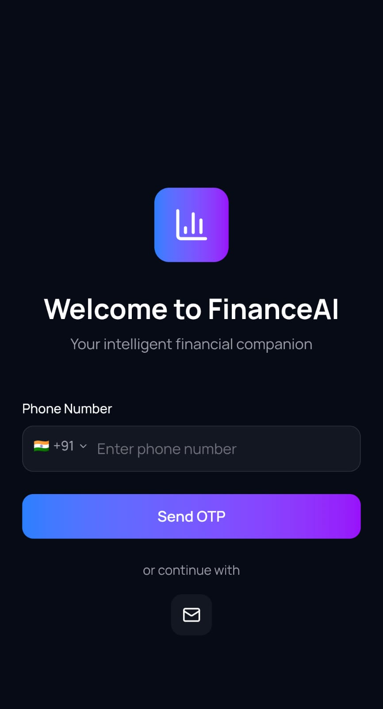
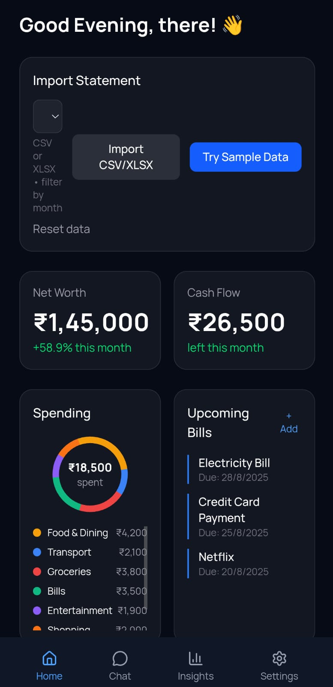
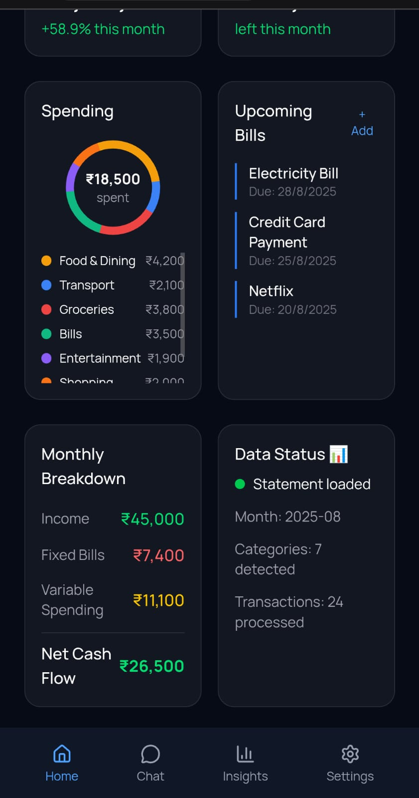
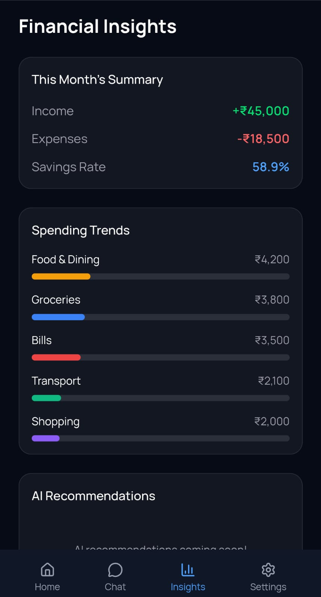
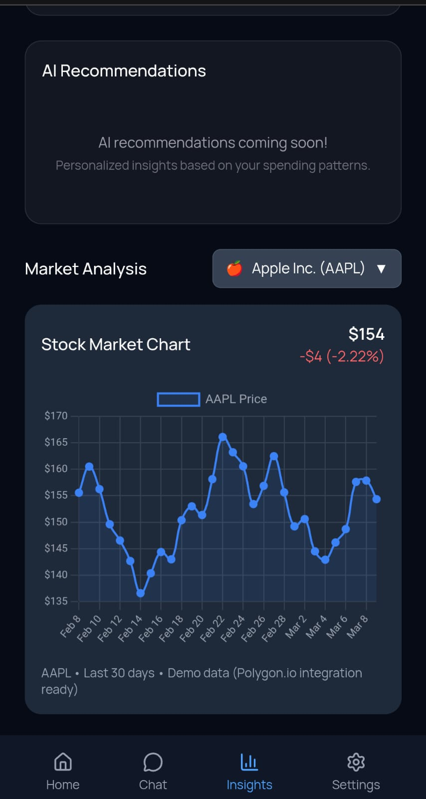
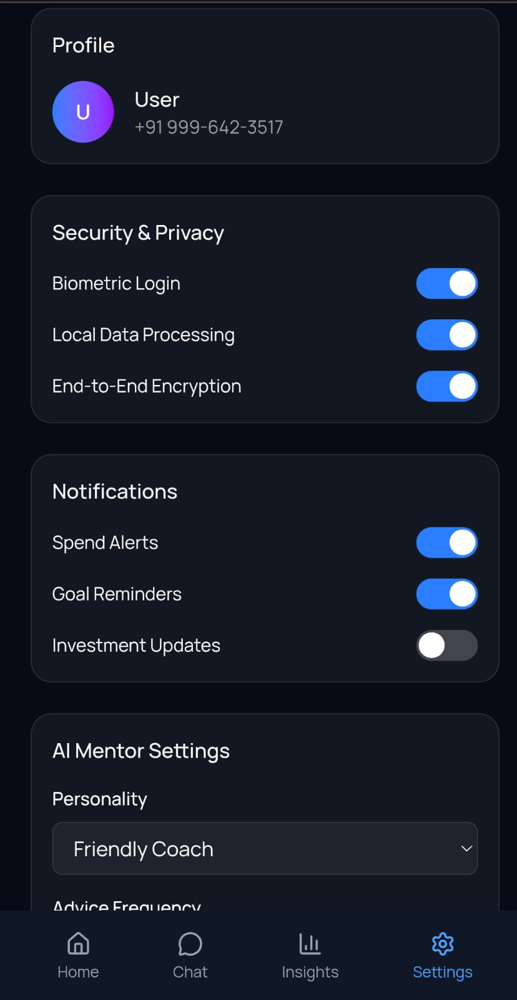

# NetWorth AI 💰

An AI-powered personal finance assistant that helps you track spending, manage bills, monitor investments, and get personalized financial advice — all in one place.

## Features

- 📊 **Dashboard** — Net worth, cash flow, spending breakdown, upcoming bills
- 🤖 **AI Chat** — Ask your finances anything, powered by Groq (LLaMA 3.3)
- 📈 **Insights** — Spending trends, savings rate, category breakdown
- 📉 **Market Charts** — Live stock and crypto price tracking
- 🎭 **AI Personalities** — Friendly Coach, Professional Advisor, Minimalist Numbers
- 📁 **Statement Import** — Upload CSV/XLSX bank statements for analysis
- ## AI Mentor Personalities

You can change the tone of the AI chatbot from the **Settings → AI Mentor Settings → Personality** dropdown:

| Personality | Tone | Best For |
|---|---|---|
| 🧑‍🏫 Friendly Coach | Warm, encouraging, uses emojis | Beginners, casual use |
| 💼 Professional Advisor | Formal, data-driven, precise | Serious financial planning |
| 🔢 Minimalist Numbers | Bullet points and figures only | Quick facts, no fluff |

The selected personality is applied instantly — just switch and start chatting!

## Tech Stack

**Frontend**
- Next.js 15 + TypeScript
- Tailwind CSS v4
- React Markdown

**Backend**
- FastAPI + Python
- Groq API (LLaMA 3.3 70B)
- Polygon.io (stock data)

## Getting Started

### Prerequisites
- Node.js 18+
- Python 3.10+
- Groq API key → [console.groq.com](https://console.groq.com)
- Polygon.io API key → [polygon.io](https://polygon.io)

### Backend Setup
```bash
cd backend
pip install -r requirements.txt
```

Create `backend/.env.local`:
```
GROQ_API_KEY=your_groq_key_here
POLYGON_API_KEY=your_polygon_key_here
```

Run the server:
```bash
uvicorn app.main:app --reload
```

Backend runs at `http://localhost:8000`
API docs at `http://localhost:8000/docs`

### Frontend Setup
```bash
cd Frontend/app
npm install
npm run dev
```

Frontend runs at `http://localhost:3000`

## Project Structure
```
Networth-ai/
├── backend/
│   └── app/
│       ├── main.py          # FastAPI routes
│       ├── market_data.py   # Stock/crypto data
│       └── services/
│           └── _services.py # Financial logic
├── Frontend/
│   └── app/
│       └── src/app/
│           ├── pages/       # Page components
│           ├── components/  # UI components
│           └── services/    # API client
└── README.md
```

## Screenshots

### Login


### Dashboard



### Chat


### Insights



### Settings


## License

MIT
